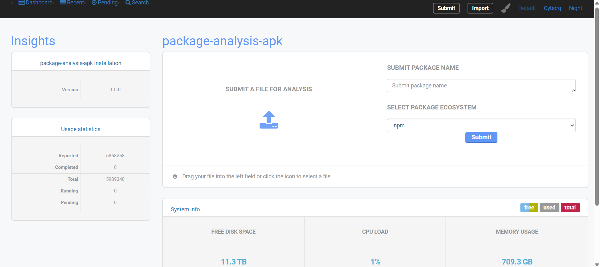
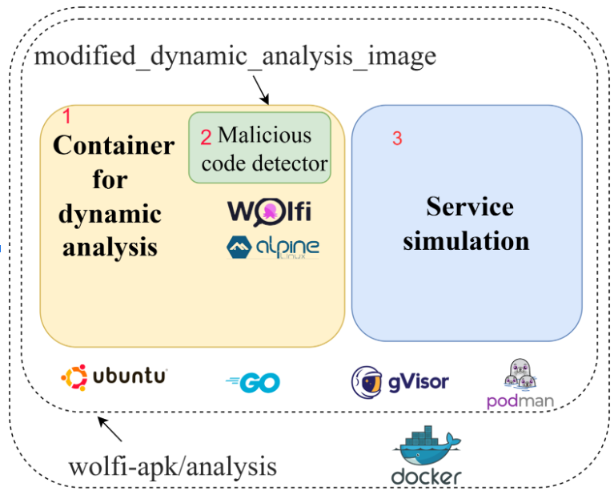

# Advanced Package Analysis

This repository aims to improve [package-analysis](https://github.com/ossf/package-analysis/tree/main) to analyze open-source packages for malicious code.  _package-analysis_ is a tool OpenSSF maintains to support scanning packages from open-source repositories such as npm, PyPi, RubyGems, Packagist, and Crates.io. 

# Dashboard

**Figure: Dashboard web interface**

The figure above shows the dashboard web interface for advanced package analysis. There are two options: the user can upload a file sample for analysis, or The user can also enter a package name and package ecosystem for dynamic analysis.

# Multi-language support
_package_analysis currently only supports packages from npm, PyPi, RubyGems, Packagist, and Crates.io repositories, we aim to extend this to  Java packages from Maven Central.

# Windows support
_package-analysis_ currently supports only a Linux sandbox. We aim to extend its capability to support the Windows environment. This will require developing a Windows kernel and its utilities.

Our method is to run Windows containers on Windows 10/11 Pro because Windows Pro is currently supported by Windows Image for Container. 
We must modify gVisor to support the Windows environment since it contributes to primary support in the Linux container.
This might be a big task because of gVisor's complexity.

# Data Visualization
A dashboard will help users submit a package for analysis, visualize their behavior, and search for specific patterns in their behavioral traces.

The user can receive scan results of the behavior of the sample, such as what network it connects to, what files it accesses, and the commands it executes.
We also use YARA rules to detect various types of malicious behaviors. Alerts are generated if suspicious activity is detected during dynamic analysis.

# Behaviour Tracking
- We will track the behavioral changes of open-source packages in terms of system calls, network and domain communications, and executed commands.
This will let the maintainers of the projects identify suspicious changes introduced by attackers or legitimate maintainers. 

# Our proposed architecture

**Figure 1: Proposed architecture**

We modify the current analysis scripts in package-analysis and rewrite the dynamic analysis images. Figure 1 above shows our proposed architecture for analyzing samples. 
We first modify the Dockerfile file to use the base image for the Wolfi Linux Distribution. We then set up the necessary dependencies (e.g., environment for analysis script In this setup we use Python as the primary language for analysis script. Some Wolfi apk do not contain executable files but source code libraries instead. So, the environment for some languages, such as npm and RubyGems, is necessary.) to install and execute Wolfi apks.

We develop a new analysis script to install and execute the Wolfi APK sample inside a sandbox container. After that, we rebuild the Docker image for dynamic analysis, containing analysis scripts for analyzing  Wolfi APK in the sandboxed container. In this proposal, we keep the outer container and propose a new inner container. As shown in Figure 1, we introduce a malicious code detector module to detect malicious patterns based on the raw analysis results.

# Service Simulation
We will create fake services such as HTTP, HTTPS, FTP, IRC, DNS, SMTP which are useful when analyzing the network behavior of malware samples without connecting them to the Internet. For example, there are cases when we need to analyze malicious apks that connect to a C&C server, which has been taken down. In this proposal, we consider using the following simulation tools:
- Inetsim: a software suite for simulating common internet services in a lab environment
- flare-fakenet-ng: a tool to intercept and redirect all or specific network traffic while simulating legitimate.

# Malware Detection 
package-analysis, does not indicate whether a package is malicious. Users of the tool must manually analyze the raw results it produces to make informed decisions. We will apply the following techniques to automatically identify malicious packages on the raw results generated by the tool
* Signatures-based
* YARA rules
* Machine learning/ Deep learning/LLMs

# Current Status

- [x] Record system calls (completed)
- [x] Design a UI (completed)
- [x] Support Wofi APKs
- [ ] Implement service simulation module
<!-- - [ ] Support Rust packages -->
- [ ] Support Java packages
- [ ] Support Windows-based packages

