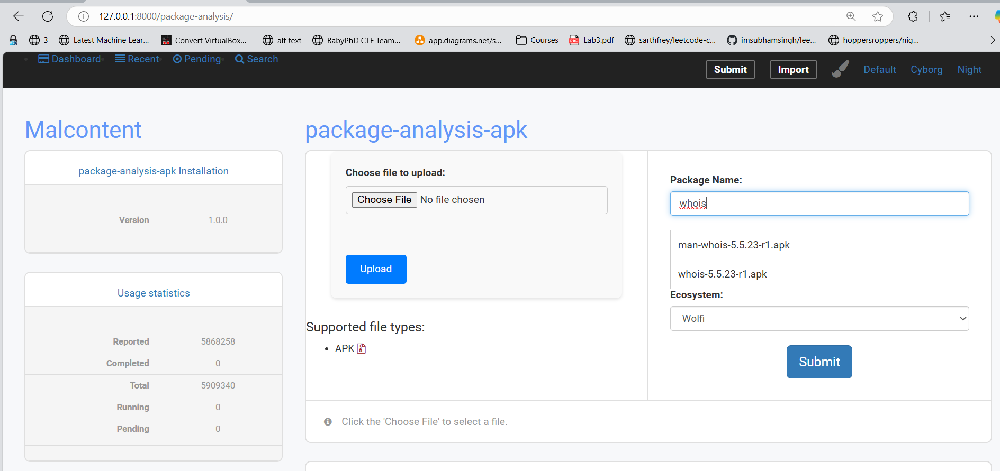
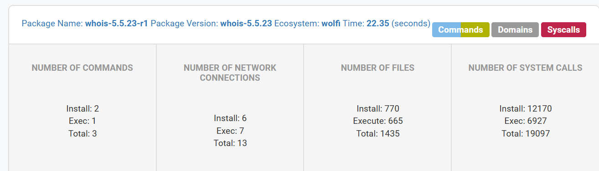
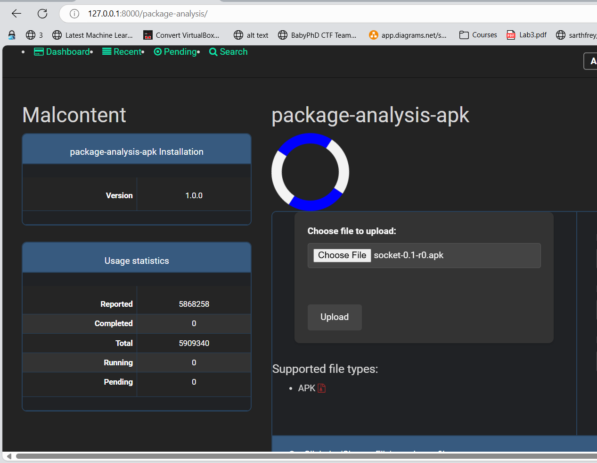
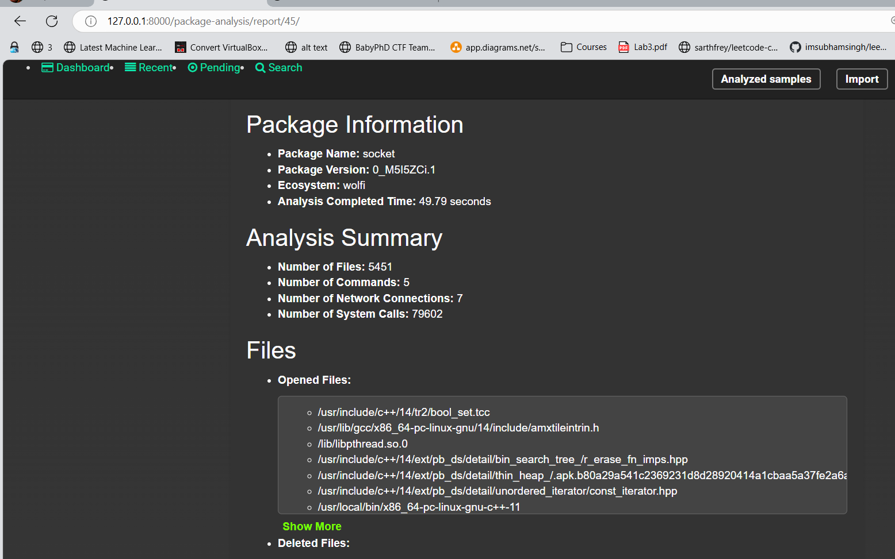
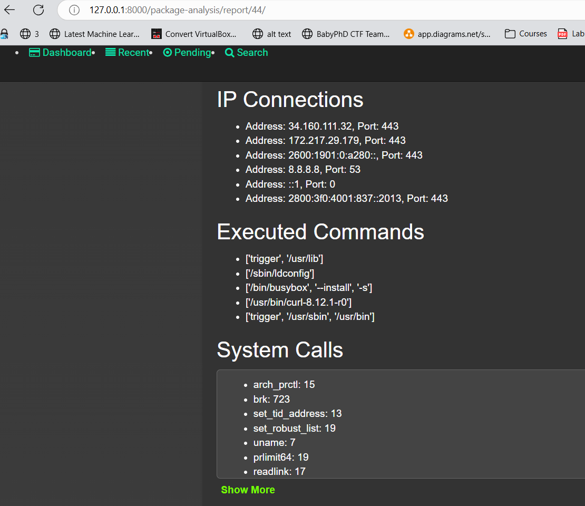
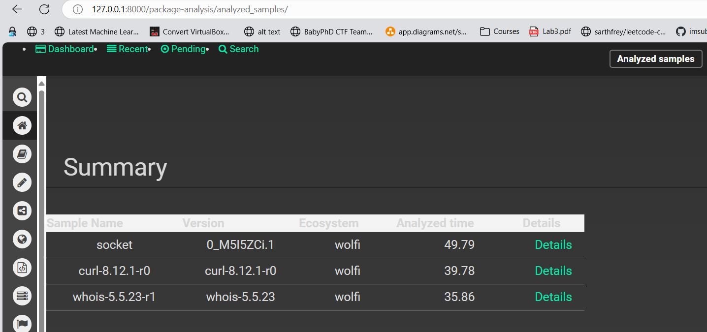
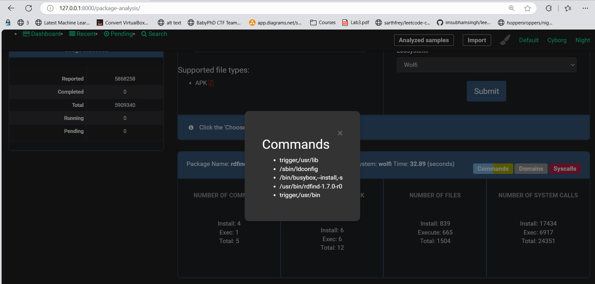
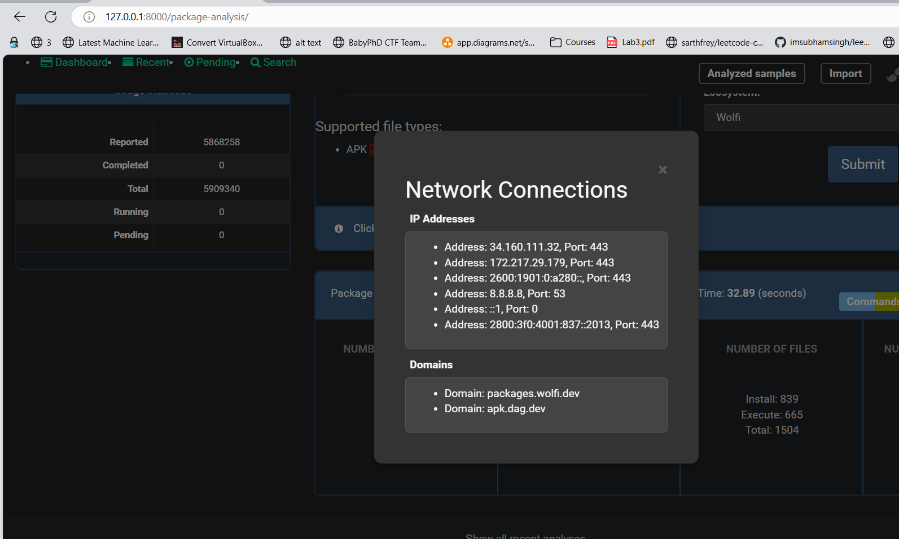

# Web Interface for Package Analysis

## Installation

### Requirements
- Docker
- Django
- requests
- WSL (Windows Subsystem for Linux) on Windows or Linux

## Usage

```bash
cd Pack-A-Mal/web/package-analysis-web
```

Create Database to store informations:

```bash
    python manage.py makemigrations
```

Then apply these migrations to our database, run this command:

```bash
    python manage.py migrate
```

Run the server by using this command. 
```bash
python manage.py runserver
```

Access the web interface at [127.0.0.1:8000/package-analysis](http://127.0.0.1:8000/package-analysis)

## Demo

### Dashboard
When searching for a package, a list of packages in the Wolfi registry will be displayed.


### Scan Results
After providing the necessary information (package name, version, and ecosystem), the system will run the Pack-A-Mal tool to generate scan reports, which will be displayed on the dashboard.

The scan results include:
- Number of executed commands
- Number of accessed files
- Number of system calls

The analysis consists of two phases: installation and execution.



During analysis, a loader will appear.



### Report Details
Detailed reports include:
- System calls and their counts during sample analysis
- Analysis history, sorted by the latest analysis




The system calls list will be categorized by type and count.



Clicking on a report box will display detailed analysis in a pop-up tab.



